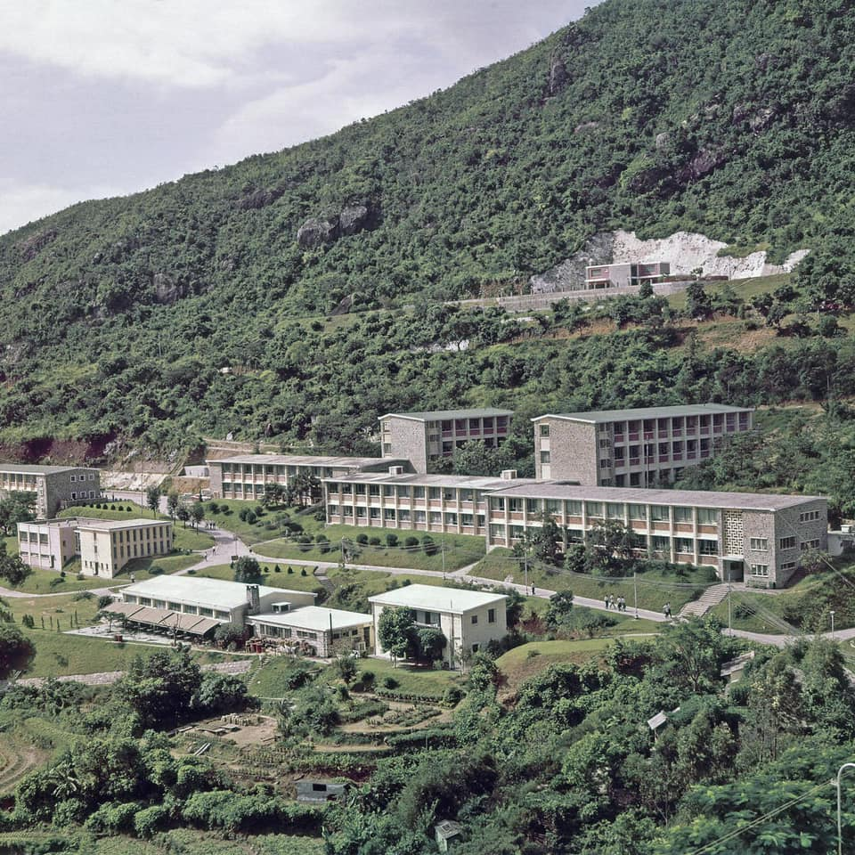
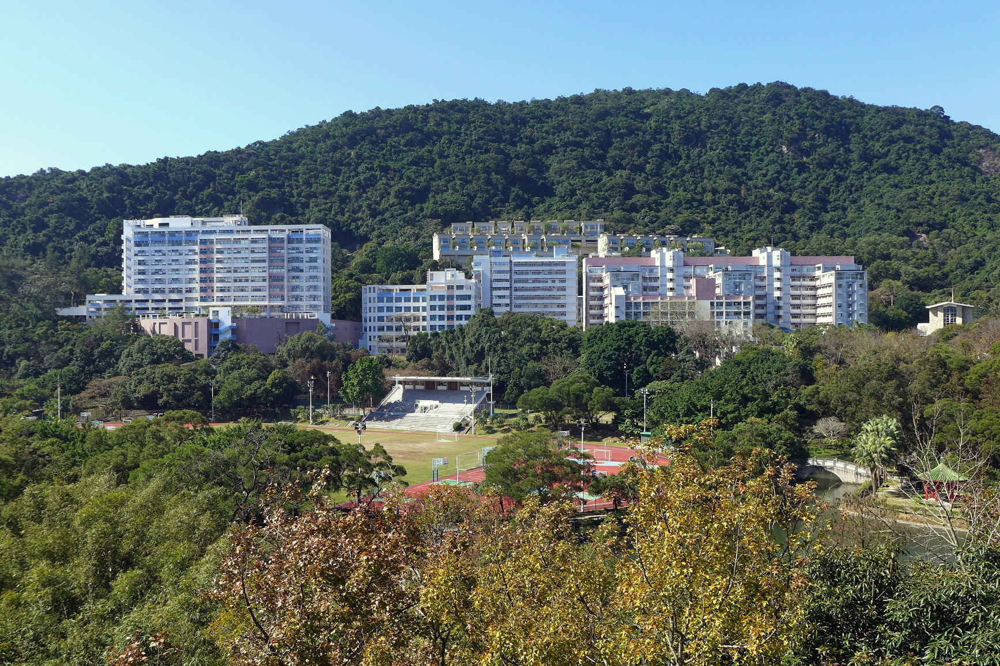

（文章寫於去年底，略修改後於本月五號發表於香港明報 －[中大草木](https://news.mingpao.com/pns/作家專欄/article/20210305/s00018/1614883741158/世紀-五無閒話-中大草木) 。從寫作到發表的過程中，非常感謝文中兩位朋友的幫助，特別是林提供的許多照片，以及Cleo為如何投稿指點迷津。現在再看一遍，又喚起了我對中大的許多回憶，這些回憶甚至比照片能够記錄下的更加鮮活。如果它能够傳達給讀者一點相同的感受 ，哪怕只有一點點，也是寫作的小小價值。）

上週偶然在面書上看到一張中大崇基學院（CC）的的舊照，興沖沖whatsapp同在北德的朋友林。林是CC人，上學期間更曾住校一年，應當對本院有相當了解。 我倆研究半日，實在分辨不出，只好以當年的未圓湖造湖運動帶來的滄海桑田匆匆作結。

    
    
早期崇基校園

雖然這片校舍被我倆的無知強行沈入湖底，但是這種尷尬其實情有可原。半個世紀以來中大的風貌經歷了極大變化，其中一大部分要歸功於廣植樹木。

五十年前，位處香港新界的馬料水，還是一片稻田。當時吐露港尚未填海，東鐵綫上的紅皮火車，沿著海岸線嗚嗚駛過。車門開啟，年輕的學子魚貫而出，他們大步跨過縱橫的田壠，奔向晨曦中的山間校舍。不過，這樣吉卜力般的畫面並不現實。從我在校史館見過的舊照來看，這些學子當年見到的應該是一片光禿禿的山頭，和其間零星幾棟低矮平房。

十年樹木，百年樹人。五十年的耕耘，前輩們把中大從人跡罕至的荒山野嶺，改造成了一塊亞熱帶植物樂土。相信每個中大人都有自己心中的中大草木：比如我的文青朋友Cleo對科學館對出的黃鐘木情有獨鍾。黃鐘木每年仲春開花，花系金黃，要待到滿樹金華盡落才抽出新葉。如此璀璨爛漫，難怪她會喜歡。朋友林坦白她最喜歡“未圓湖會變色的樹”，自不必說是未圓湖畔的一排落羽松：每年深秋換季，他們的紅棕色的挺拔身影是中大勝景之首。她還特別提到“每年會變好多黃花的樹”，我猜想是黃鐘木或者台灣相思。台灣相思是多年生高大喬木，秋涼後綻開一樹小小黃花，他們在中大，特別是新亞書院生長得極為繁盛。戰後香港百廢待舉，台灣相思因其生長快速的優點，曾在本地廣為種植。但我更願意相信，在這個無盡鄉愁的名字中，寄放著輾轉南下的中大先賢們，於那個回不去的文化中國的無盡物哀。

    
    
現代崇基校園，可見未圓湖及獅子亭（右）

我說不出最愛的草木，但能叫上他們的名字。火車站前的一字排開高大的白千層，粵語也能唸作百千層，給永遠炎熱的夏投下了陰涼。白千層對面，民主女神像身後有一株鳳凰木。和它魁梧沈默的長青鄰居不同，鳳凰木在每年盛夏熱烈綻放，彷如火焠的花朵盛極飄零。然這株鳳凰木在我畢業後的一個夏天因颱風折腰，似乎應了“木秀於林，風必摧之”的老話，令人思之不快。不說這事了，讓我們繼續沿著校巴線上行。從山腳的崇基到主要教學樓所在的“本部”，若是春天，在邵逸夫科學大樓（彩虹樓）底層會有精靈般的藍花楹一閃而過。站在百萬大道上，夾道的是香港市花洋紫荊，還有色作粉，白，以及粉白的宮粉羊蹄甲。怎樣區分洋紫荊和宮粉羊蹄甲？除了顏色之外（前者是紫紅色的），後者的花瓣更小也更密集，花期見花不見葉。中大的宮粉以資訊科技處門前的那棵為最大，它穿著一身白，垂下的萬縷柔絲不勝嬌羞，彷若要嫁與春風的新娘！

在百萬大道右側，景園中噴泉流水潺潺，其上的勒杜鵑紅雲靄靄。他們身後拔地而起的一片山崖，將山上的新亞與聯合書院從“本部”切割開來。當年怪石嶙峋的山脊，如今面向“本部”的陽面萬木爭榮，以致那兩條山間“天梯”幾乎難覓蹤影。向陰的那一面，即聯合與和聲書院對峙的那一面山牆，也不遑多讓，覆滿了蔥蘢的各種蕨類和厚厚的青苔------中學生物學過，這是本地空氣質素優良的見證。百萬大道左側，從行政樓直到學生會，則是各色杜鵑花的天下：杜鵑花期長，顏色又鮮豔，他們在夏初的花期若又趕上晴日，真是畢業生照相日（Photo Day）的好日子。啊，我怎麼又感傷了！

香港從來春夏多雨，但因為中大的草木，我喜歡香港的雨。不趕時間的話，我喜歡慢吞吞從本部穿過山間小徑去崇基吃飯。雨來了，演繹雨聲的是植物的葉子。我不像生物學家David Haskell一樣，能從一滴雨裡聽到植物多樣性的大千世界，我只覺得悅耳動聽。雨撫過高處杉樹的樹冠，溜過常青藤的葉子，或者通過敲擊落葉發出輕響。林中鳴聲上下，腳下移步換景，不知不覺山腳朱紅色的獅子已在眼前。走到一株細葉榕下打算啪一聲收傘，卻發現昨夜開始淅淅瀝瀝的雨，不知什麼時候停了。

當然，中大的草木並非盡善盡美。雖然造林者野心可嘉，好些水土不服的案例，本可以避免。廣為人知的有新亞櫻花，鮮為人知的有文研館的柳樹。南橘北枳的道理任誰都明白，栽種柳樹尚且能說是情懷，但在亞熱帶地區種櫻花？我也不知道為什麼。

和中大草木的有關的新聞或報導，最矚目者非盜伐土沉香莫屬。土沉香是香港原生樹種，因其可用於製造香料，具有較高的經濟價值。然而懷璧其罪，身有異香的土沉香成了不法分子的偷伐走私的目標。先偷偷摸摸地折下樹枝，再大搖大擺地放倒整個樹幹，最後如入無人之地般闖入校園，將20米高的大樹連根掘起。這樣得寸進尺，竭澤而漁的狂行，竟使一度廣泛分佈在港九新界的沉香木，如今難覓香蹤。中大的那株遭到荼毒的沉香木，事後被學生塗上油漆，希望通過阻止結香，反擊盜伐。沉香不香，縱然僥倖偷得一命，若草木也知愁，沉香樹自己必無甚趣味。現在想來，沉香樹的命運，對於這座以香得名的城市，難道不是異兆悲音麼？

