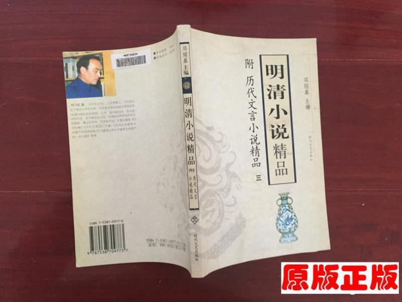

余憶童稚時，不愛追逐打鬧，不善唱歌跳舞，惟酷愛讀閒書雜書。我固然讀過對我思想、品格都影響深遠的名篇，也翻過不少在今天看來是封建糟粕的東西。比如說我能想得起的這一本《明清小說精品》：

    
    
網圖，內容大多是三言、二拍一類

## 玉堂春

書應在我大舅家，我記得這裡面第一個故事是《玉堂春》。對京劇有認識的朋友可能略聞「蘇三離了洪桐縣⋯⋯過往的君子聽我言⋯⋯」；沒聽過也不要繄，讓蘇三，啊不我何大，用四個bullet points向過往的君子說清楚：

1. 起：英俊富有的王公子愛上名妓蘇三，斥重金買下其初夜
2. 承：王公子為蘇三耗盡家財，被家人中斷使費
3. 轉：王公子被蘇三點醒，發憤苦讀。高中還鄉後却驚覺蘇三被轉賣給過路商人，下落不明
4. 合：王老爺前往洪桐縣履新，恰好救了蒙受殺夫之冤的蘇三。二人修成正果

別看《玉堂春》篇幅不長，它估計集齊了古今市民小說所有喜聞樂見的要素：才子佳人一夕生情、臥薪嘗膽一朝逆襲、婚禮前夕好事多磨、雲開月明兒女滿堂。是不是很熟悉？連蘇三如何被冤，都有抄襲《水滸傳》的重大嫌疑：商人妻夥同情夫以及馬婆六藥死了商人，轉眼嫁禍給新買來的妾蘇三。那男主是怎樣一個人呢？我看原作以及維基的介紹，都強調他深愛蘇三。當他以為此生相見無望，却在洪桐縣的死牢裡再會為他遍歷世間艱辛的愛人——高高在上的王老爺板起了臉孔，聲色俱厲地質問面前的死囚，被賣為妾後是否和商人發生過性關系？蘇三道，王老爺，王青天，民女極力反抗、誓死不從。那和別的男人呢？蘇三道，奴家雖出身勾欄，却知貞潔，此身惟南京王公子一人。王公子方才笑逐顏開，與蘇三相認，成就一段感天動地的愛情。

可不是嗎，連王公子出自名門的正妻，都被他二人的愛情所感動： 她提出應根據先到先得的原則，讓蘇三為妻，自己做妾。蘇三當然以自己出身微賤而謙讓。兩人爭相做妾，最終鹿死誰手我不記得了，不過作者最後貼心地指出王公子的妻妾俱有子——打造一個有中國特色的童話式結局。

## 賣油郎獨佔花魁

「落難公子妓家戀」看膩了？《賣油郎獨佔花魁》則別出心裁，講述了賣油維生的小青年秦重，如何靠著自己的溫柔善良，打動並迎娶名妓美娘。秦重既非能文能武，又非大富大貴，文中連對他的相貌也沒有側重描寫，撐死了是個三分清秀的小厮臉，大概率是個老實人長相。老實人秦重在外出工作時對美娘一見傾心，覺得此人非睡不可。可他不但沒有變得喪心病狂，而是開始喪心病狂地攢錢：美娘是個妓女，他向老鴇打探過美娘一晚的價錢，正是十兩紋銀，他的幾年收入。他拼命工作，他節衣縮食，終於等到這一晚，美娘却喝得酩酊大醉。而情深意重的秦重，不但沒趁人之危，還對美娘呵護有加。於是美娘就愛上她啦！之後兩人又一起經歷了裹脚布之變，遂萌結為夫妻之心。最後美娘自掏腰包贖身下嫁，兩人還各自認回了失散多年的父母，生怕給讀者留下一點點遺憾！

美娘除了色藝俱佳，因為文采出眾，不讓男子，還有「花魁」之名。這樣的奇女子，沒有給大腹便便的年邁官人做填房，而是用自己的錢嫁給老實人，還是頭婚正妻，讀者想必都為她的幸福落淚。「遇到老實人就嫁了」，難道不是古今共鳴嗎？且看昨晚春節聯歡晚會就知道。

我在明讚暗諷？讀者可別誤解，實則《賣油郎獨佔花魁》是全書我最喜歡的篇章之一。秦重諧音情重，而且其人踏實上進，做生意從不缺斤短兩，可比《紅樓夢》裡姐姐還沒涼就和尼姑鬼混的「情重」可愛得多。他精打細算的勁頭，頓令金生座的我生出惺惺相惜之心。除了兩人相戀相知的主線故事，更有許多精彩絕倫的段落：除了秦重的生意經能作為今人研究明清民生的寶貴資料，文中老鴇巧舌如簧，動以情理，勸說美娘下海這一節也寫得讓人擊節讚嘆。三言兩語，就將一個要死要活的姑娘，說成了為自己的自由、前途努力打拼的堅強女性。看到這裡，我決定正式認同馮夢龍的文學水平（這是誰給的臉）。

## 杜十娘怒沉百寶箱

和美娘一樣，杜十娘是個沉魚落雁、才情艷絕的一代名妓。杜十娘年幼即不幸淪為雛妓，但一心盼從良，後委身於愛慕追求她的公子李甲。但在古代（男）人創作的故事裡，傾城常有，而老實人不常有。李甲有一個仿如曾侯墓出土的文藝名字，人却沒品之極：大享艷福後，他終日如驚弓之鳥，不是懼怕金屋藏嬌被父母發現，就是擔心為泡杜十娘虧空的銀子被父母發現。有一日他和杜十娘行舟在江河之上，恰巧被對面船上客人看上十娘美貌，提出以千金向李甲購買十娘。李甲欣然同意，美娘內心大怒面上却冷然讚同。交接那一日，她立在船弦上，當著負心漢和登徒子的面打開了她一直隨身攜帶的箱奩，亮出了內裡價值萬金的珍寶，並痛斥二人的行徑。見到金珠寶貝的李甲感到後悔，非常後悔；然杜十娘心意已決，抱著百寶箱跳入波濤之中，留下李甲人財兩空。

縱觀全書，這樣慘烈至極的bad ending也少有。杜十娘是失敗了，敗得很徹底：她閱人無數，却識人不明；她有萬貫的家財，却買不來一個指靠； 她有水一樣的柔腸，火一樣的意志，却只能用這樣最消極的方式去反抗。可恨啊，她以為她的愛應當勝過這世上的一切，她的愛人却以為千金價值更高。可憐啊，她如果能早知道花言巧語溫柔體貼靠不住，會不會選擇搵錢養老是正經？不知道數百年後的讀者怎麼想？錢與情，孰輕孰重？塑造了杜十娘這一人並帶出這一問，僅此一點足以把馮夢龍和同時代的速讀「瑪麗蘇」區別開來。

## 尾聲

明清小說都是寫妓女的？並不是，也希望這不是大家看完這篇文章後的惟一印象！不過一個不爭的事實是，明朝中期後商業蓬勃發展，再加上陽明之學的廣泛傳播，人性的萌動頭一次讓各種愛情故事大行其道；妓女正好是廣大男性能够見得著的對象，成為故事主角並不意外。或許是自古來寫帝王將相多而食色男女少，許多故事為賺取眼球而寫得極不自然：不貼合人性而遷就意淫就算了（封建男權社會倒也情有可原），更有甚者還有誖情理：比如落魄書生一朝發跡後溺死糟糠之妻，妻子獲救後兩人又不知怎麼和好如初，這就離譜了！不過話說回來，就從明末開始算，愛情小說也流行了四百年了，很多現代作品裡流露的思想，也許連「封建糟粕」都比不上呢！

最後，為明清小說正名（當然有反應社會現實的優秀作品），我來貼上我最喜歡的一個選段，出自《儒林外史》第一回，吳敬梓筆下的擅畫荷花的畫家王冕：

「這王冕天性聰明，年紀不滿二十歲，就把那天文、地理，經史上的大學問，無一不貫通。但他性情不同：既不求官爵，又不交納朋友，終日閉戶讀書。又在楚辭圖上看見畫的屈原衣冠，他便自造一頂極高的帽子，一件極闊的衣服。遇著花明柳媚的時節，把一乘牛車載了母親，他便戴了高帽，穿了闊衣，執著鞭子，口裏唱著歌曲，在鄉村鎮上，以及湖邊，到處頑耍，惹的鄉下孩子們三五成群跟著他笑，他也不放在意下。」

